# Lab 01 Report - Introduction to Open Source Software

## 1. Discord

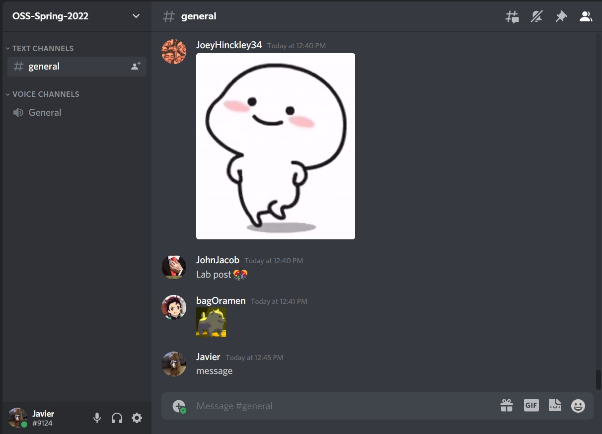

## 2. Readings

### Open Source Definition

Reading the definition of open source is definetly important if you want to try to start on a team or project. It coveres many cases and makes sure that the code being written is accessible, free, and usable to anyone who wants access. I think it's a great way to make sure the idea of open source doesn't change and that bias and outside influence has no way of damaging it.

### How To Answer Questions in a Helpful Way

#### Summary

This article is a coder's guide to forum post ettiquete. It covers many of the examples that one might encounter in day to day life while searching stack overflow. The purpose of this article is to stress the importance of understanding what you need from a forum, and how to clearly and politley get the help you need. The author was definetly condescending throughout the reading, but his points were very compelling. Being a good coder should also involve the values he tries to instill within the reader.

#### Improvments

1. When describing an issue you encountered, explain the previous attempts taken to solve the problem. This plays into the idea of "Describe the goal" and it can help someone figure out your though process while trying to reach a solution.
2. Explain any other segments of code you received help with. Some people reach out for help from different people and can take their advice into the code they write. This might be a reason they don't fully understand their code or know where the problem is coming from.

### Free Culture

RPI's community and access to technology gave students an environment to tinker. There were plenty of resources to use and the bright students had the opportunity to create extremely helpful tools. Jesse Jordan used these resources to make improvements to Microsoft’s existing search engines and made life easier for the RPI community and other campuses. His actions were a perfect example of the spirit of Open Source. There was no ulterior motive of a payout or benefits, he just wanted to improve the experience of individuals who used RPI's search engine. Because of the copyright issues that were made easily accessible with the search engine, Jesse's improvements caught the eye of the RIAA. Add to no surprise, the RIAA abused their power and wealth to try and use Jesse as a scapegoat. If we want creative ideas to thrive, we need to support the endeavors created through Open Source. But it becomes increasingly obvious that open source clashes with the values engrained into capitalism.

## 3. Linux

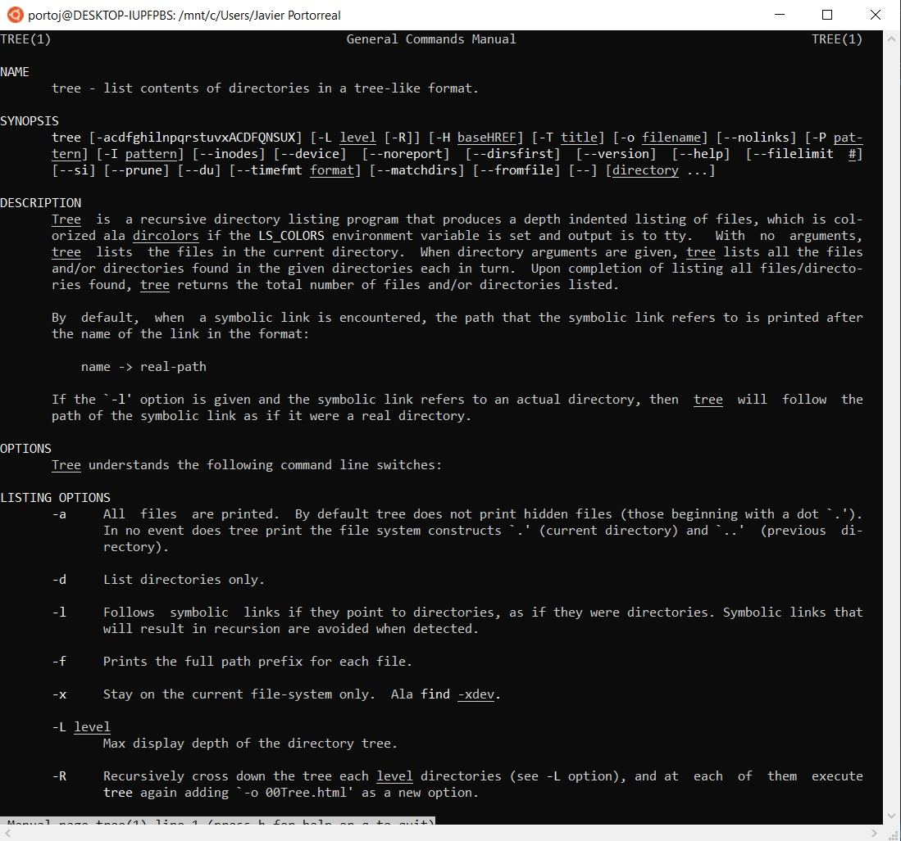

## 4. Regex

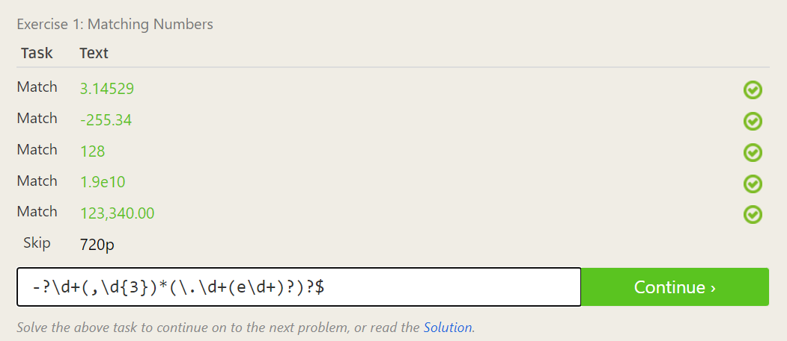
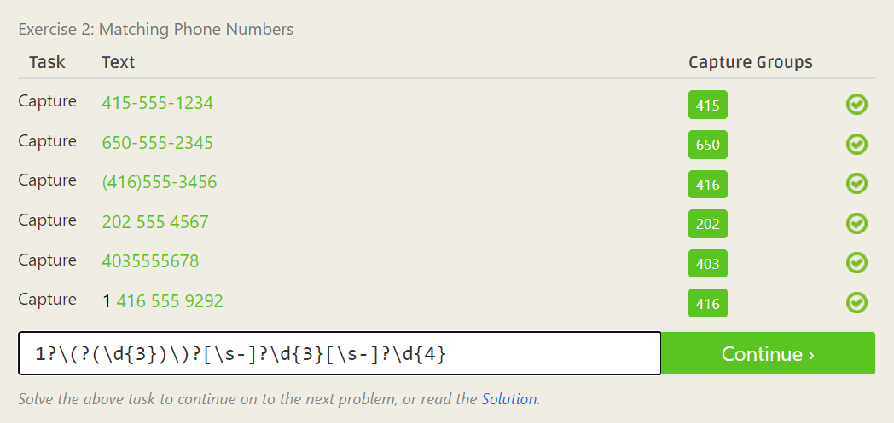
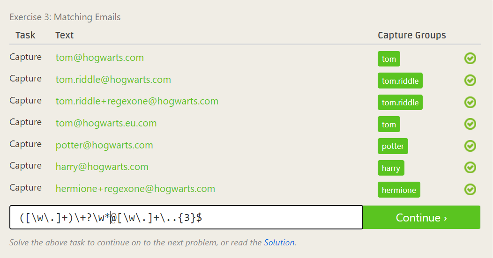
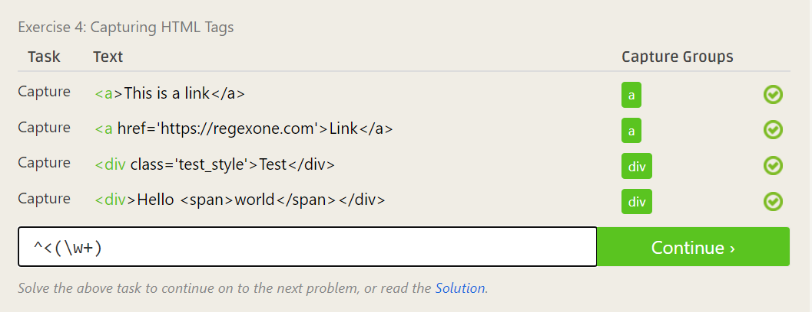
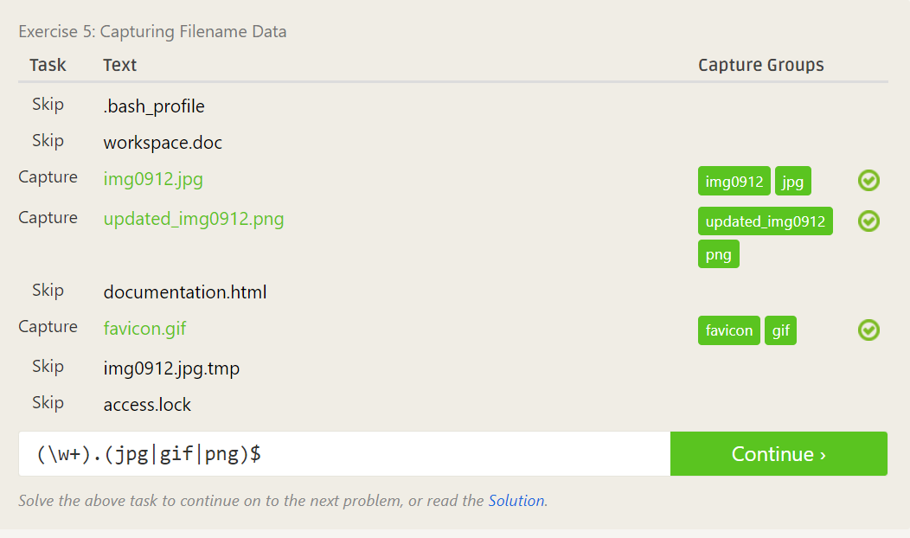
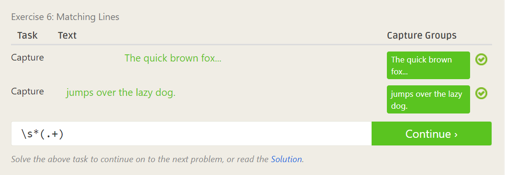
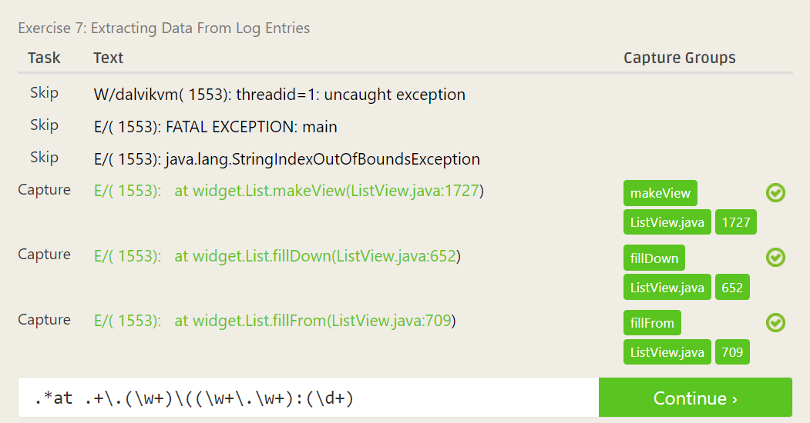

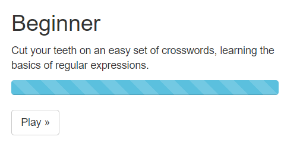

## 5. Blocky

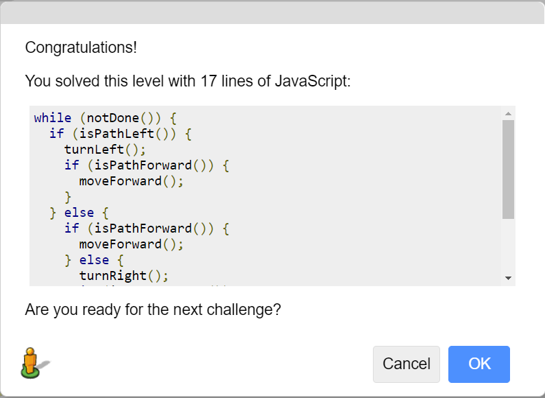

## 6. Reflection

I have worked on a few open source projects within my time at RPI. For the past few semesters, I have been contributing to Submitty. Since it is my last semester at RPI I think my time can be used most efficiently by continuing to work on the same open source problem. This will mean I won’t have to deal with any setup, onboarding, or problems that come along with joining g anew team. This will also give me the opportunity to wrap up the features I have been working on before I graduate.
