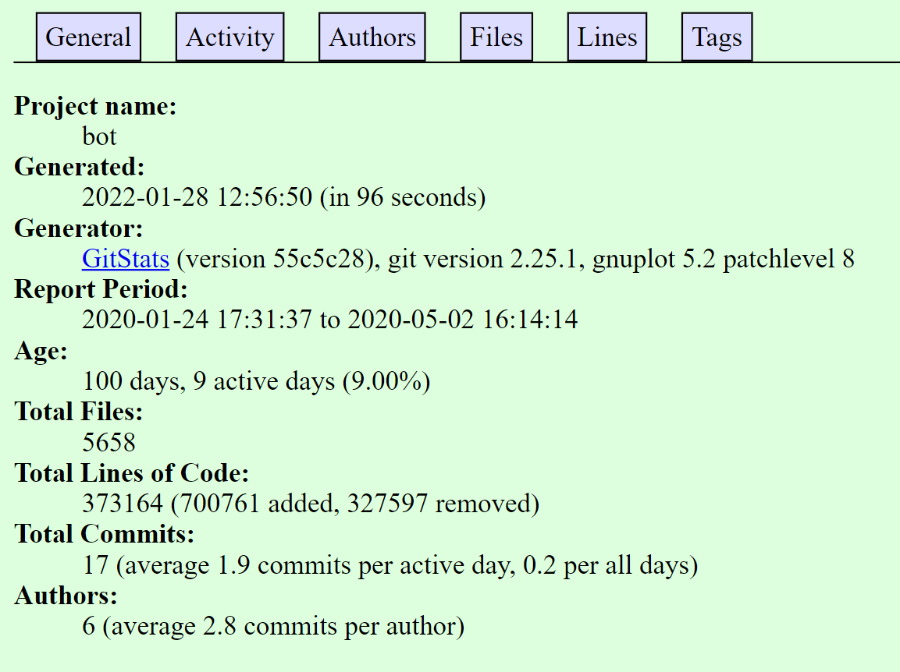
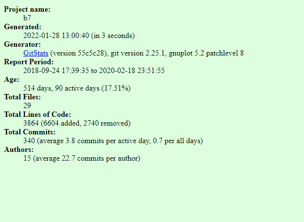
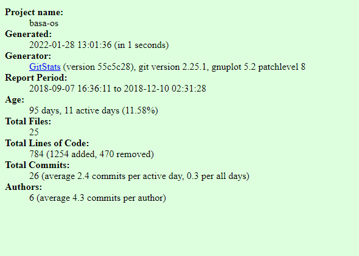
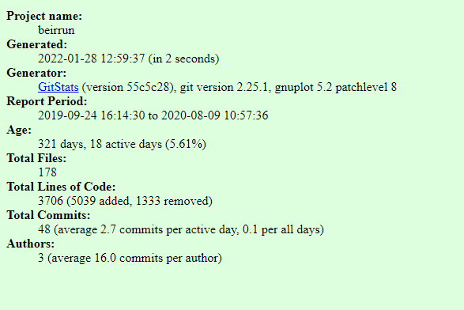
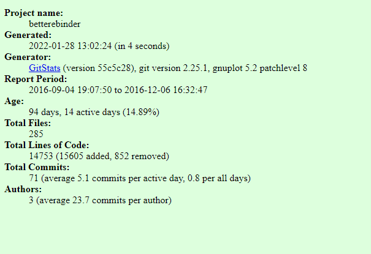

# Lab 03 Report - Git

# Part 1

## 3.

$\sqrt{1 + 2 \sqrt{1+3 \sqrt{1+4 \sqrt{1+...}}}}$

$\sqrt{2}^{\sqrt{2}^{\sqrt{2}^{\sqrt{2}...}}}$

## 4

$\begin{bmatrix}
1 & 1 & 1 & 1\\
-1 & 1 & -1 & 1\\
-1 & -1 & 1 & 1\\
1 & -1 & -1 & 1
\end{bmatrix}$

# Part 2

## 4.

### B.O.T

- 3 contributors
- 373,124 lines of code
- First Commit January 24th 2020
- Last Commit May 2nd 2020
- (master)

### B7

- 10 contributors
- 3,861 lines of code
- First Commit September 24th 2018
- Last Commit Febuary 19th 2020
- (master)

### BASA-OS

- 4 contributors
- 784 lines of code
- First Commit September 7th 2018
- Last Commit December 10th 2018
- (master)

### BeirRun

- 3 contributors
- 22,163 lines of code
- First Commit September 24th 2019
- Last Commit August 9th 2020
- (master)

### Better eBinder

- 2 contributors
- 14,753 lines of code
- First Commit October 11th 2016
- Last Commit December 6th 2016
- (master)

## 5.

### B.O.T

The stats are very similar. Here we see there are a few more reported lines of code (40 more). It also reports 2 more authors than git.

### B7

The stats are almost identical. Here we see there are a few more reported lines of code (4 more). It reports 5 more authors than git.

### BASA-OS

Gitstats shows an earlier project time than the git commits reported on github. There are the same amount of lines of code. It reports 2 more authors than git.

### BeirRun

The gitstat for this rep has a lot less lines of code reported than on github. Theres a difference of more than 18,000.

### Better eBinder

The lines of code are th exact same. Gitstat reports one more contributor and it has a start time later than github does.

## 6.

### B.O.T

### B7

### BASA-OS

### BeirRun

### Better eBinder

