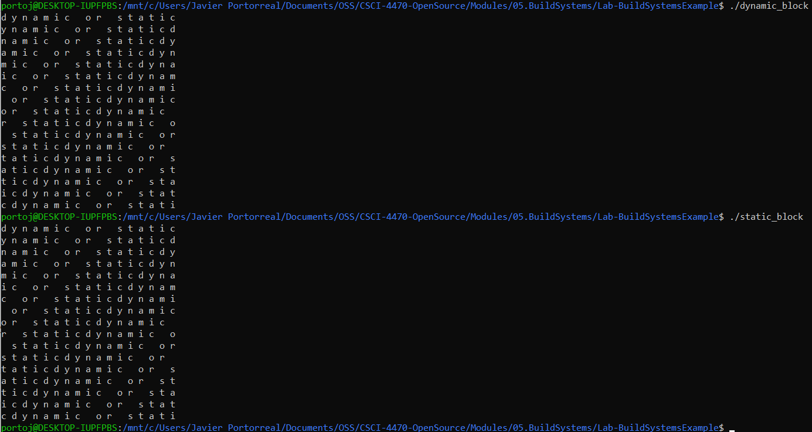

# Lab 05 Report - Build Systems

### CMake Tutorial

#### Step1

- [tutorial.cxx](step1/tutorial.cxx)
- [CMakeLists.txt](step1/CMakeLists.txt)

#### Step 2

- [tutorial.cxx](step2/tutorial.cxx)
- [CMakeLists.txt](step2/CMakeLists.txt)

#### Step 3

- [CMakeLists.txt](step3/CMakeLists1.txt)
- [MathFunctions/CMakeLists.txt](step3/CMakeLists2.txt)

#### Step 4

- [CMakeLists.txt](step4/CMakeLists1.txt)
- [MathFunctions/CMakeLists.txt](step4/CMakeLists2.txt)

#### Step 5

- [CMakeLists.txt](step5/CMakeLists1.txt)
- [MathFunctions/CMakeLists.txt](step5/CMakeLists2.txt)

### 2

- [Custom Makefile](example/Makefile1)
- [CMakeLists.txt](example/CMakeLists1.txt)
- [Created Makefile](example/Makefile2)

Sizes:

Custom:

CMake:
