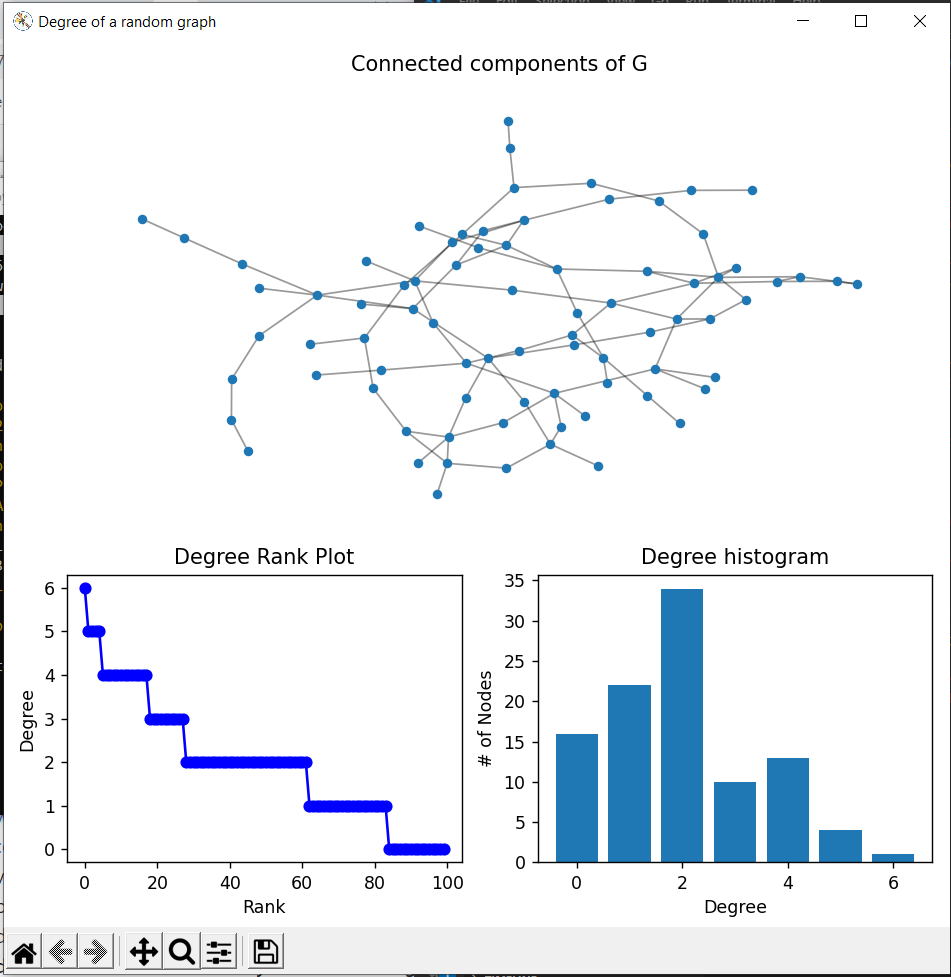

# Lab 06 Report - Scientific Computation

### 0

### 1

Results for five letter words: [results](results1.txt)
Code for five letter words: [five.py](five.py)

### 2

Results for four letter words: [results](results2.txt)
Code for four letter words: [four.py](four.py)

### 3

Results for unordered solution: [results](results3.txt)
Code for unordered solution: [unordered.py](unordered.py)
