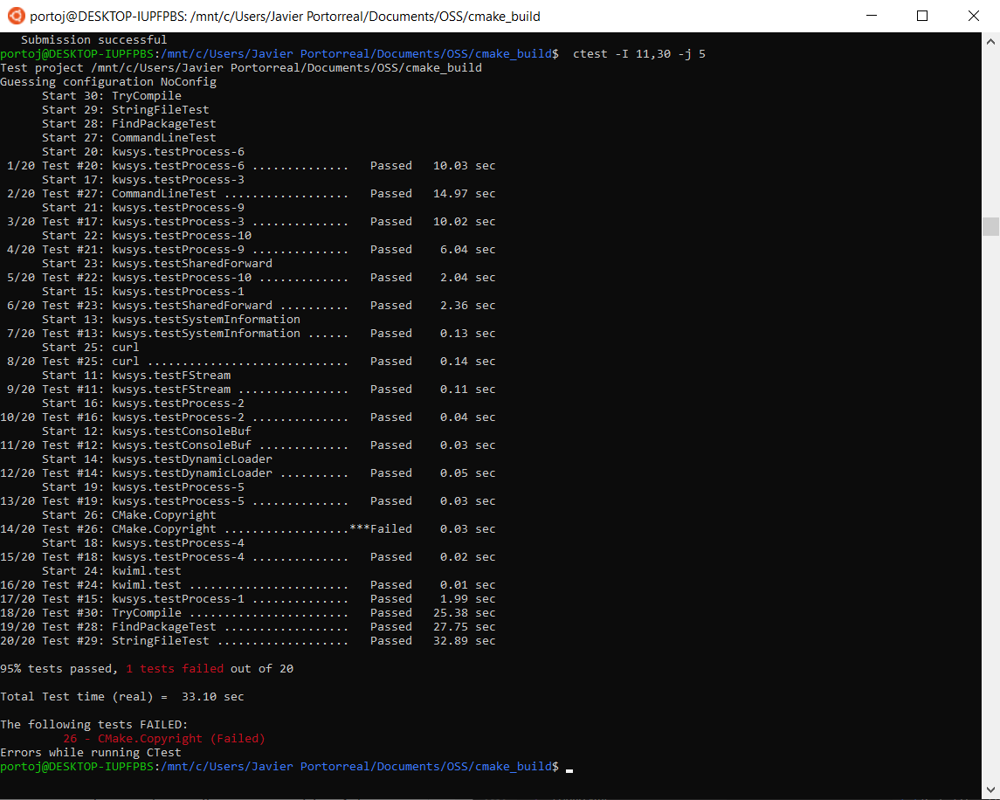

# Lab 06 Report - Testing and Continuous Integration

### 1

### 2.1

In the experimental section There are 20 tests that are run foo each build. In the Nightly section there are **hundreds** of tests run (691). If we click on the test section of the table we are able to see all og the separate test cases.

For the expiremental section there was an error in a build within the CMake.Copyright test. The two build run within Nightly have a failed test for RunCMake.CompatibleInterface. When looking at how certain tests fail, i think looking at the test cases can help us trache which section of the build is leading to an unexpected result.

A build that is similar to my computer in the master section is [#7801279](https://open.cdash.org/build/7801279). The build appears "clean" and it has no errors associated with it. I see no erros so I would have no reason to be concerned.

### 2.3

There are no errors! [here](https://open.cdash.org/viewSite.php?siteid=90595&project=1&currenttime=1647565200)

### 2.4

### 3

Failed Test:

In order to fix the error, I had to change the year of the copyright file.

## 4

[repo](https://github.com/jportorreal00/step5_example)

