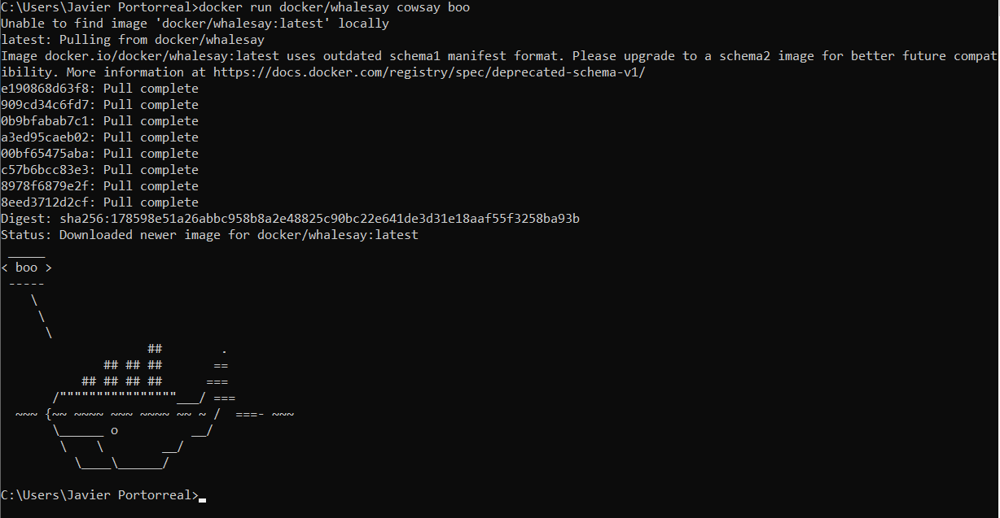
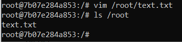
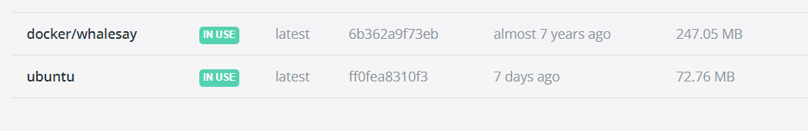
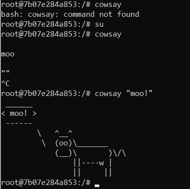
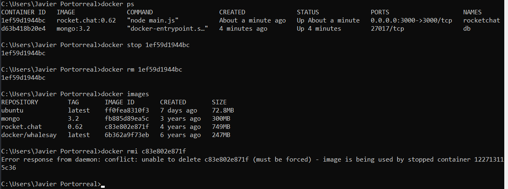
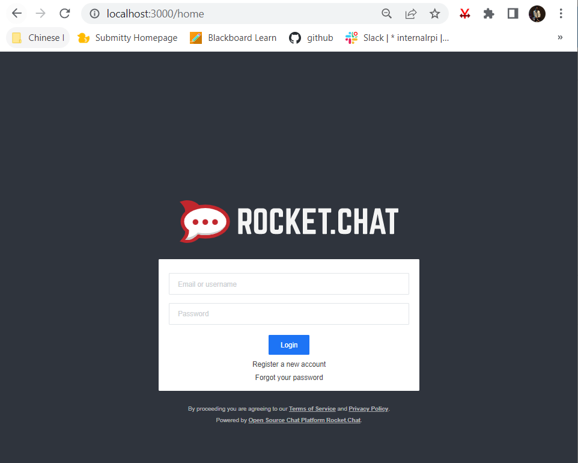
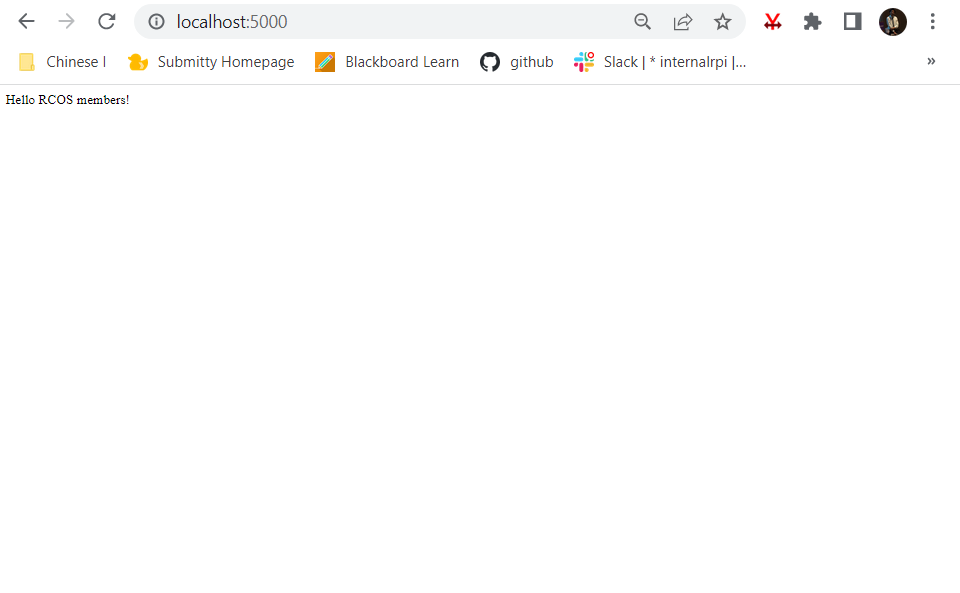

# Lab 09 Report - Virtualization and Docker

### 0

### 1

Whalesay setup

Vim file creation

Cowsay Example

### 2

Docker command examples

Rocket chat localhost

### 3

Hello Flask Server

### 4

Docker images listed

Message server failure

Docker messages examples

