# Lab 10 Report - Databases

### 0

[Step 0 Blogpost](https://github.com/jportorreal00/oss-repo-template/wiki/Open-Source-Attack)

### 1

Localhost Message

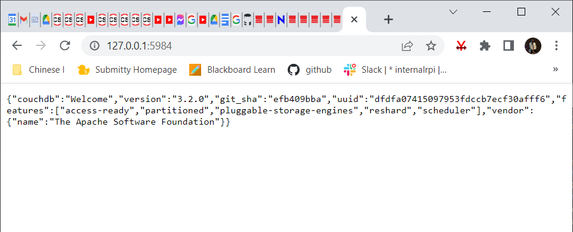

### 2

Curl Example

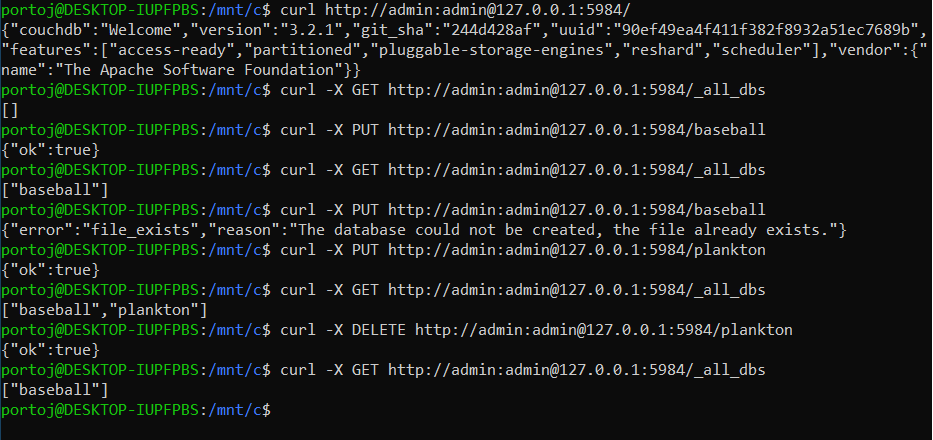

Duplication

Duplication Part 2

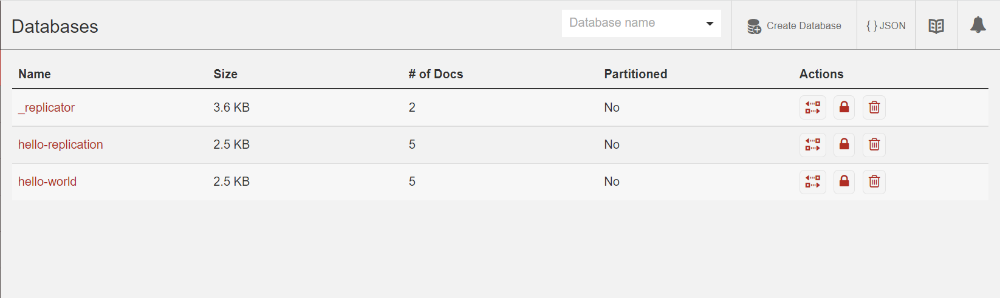

Fauxton

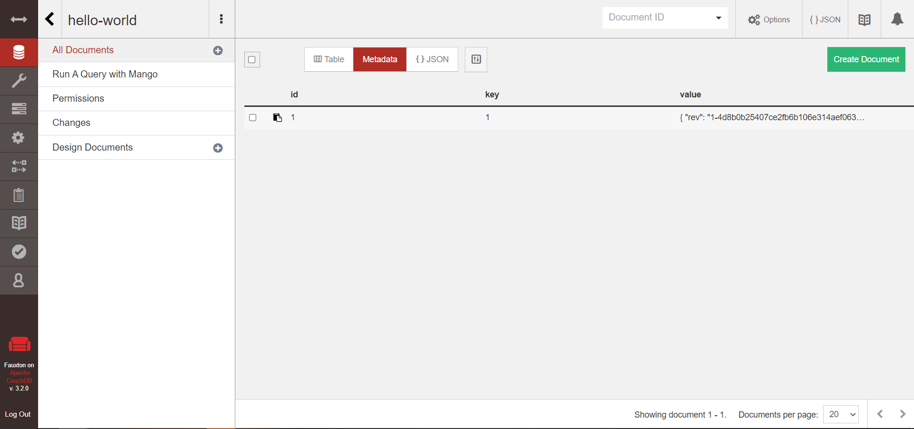

Query

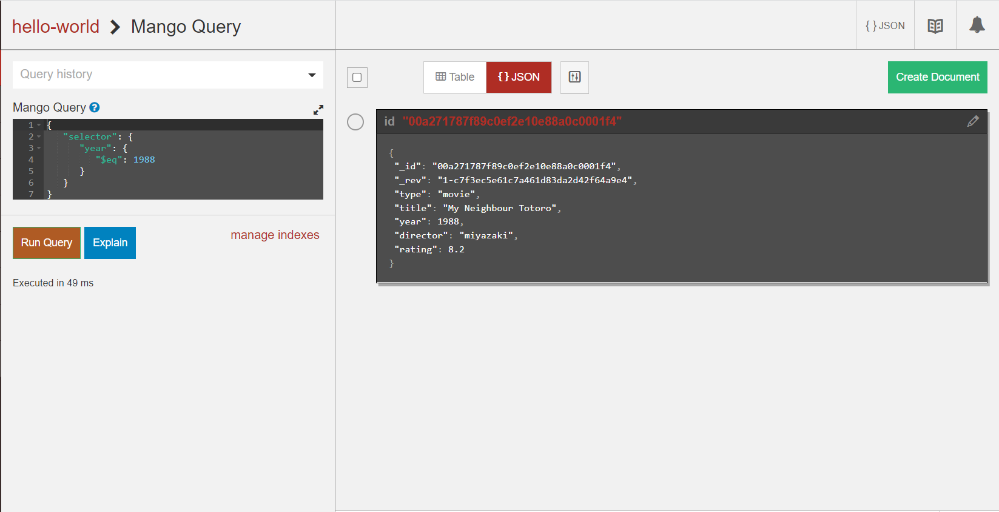

Query Part 2

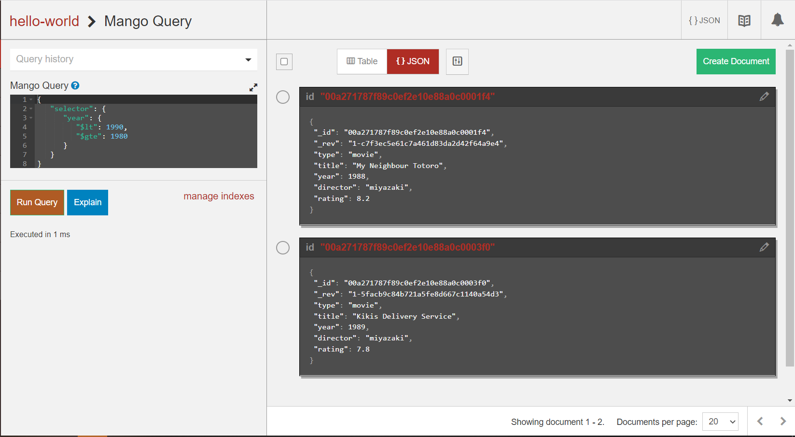

### 3

Databases

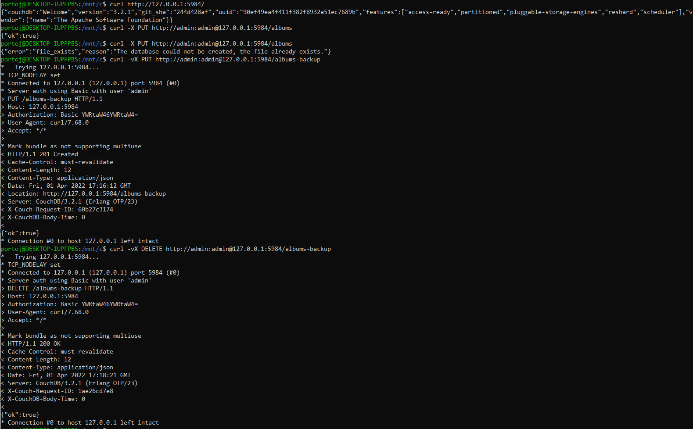

Documents

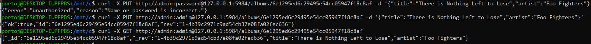

Revisions

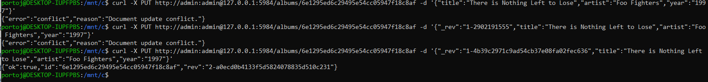

Documents in Detail

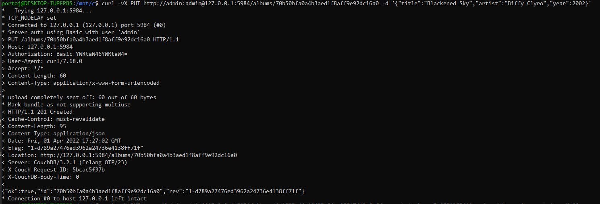

Attachments

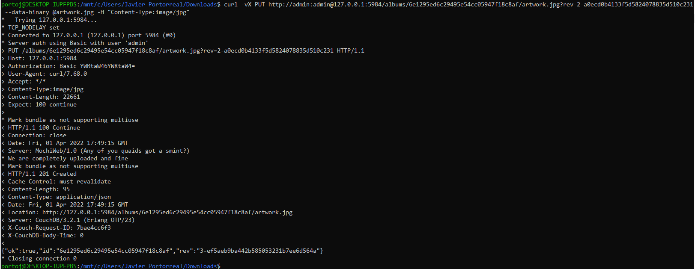

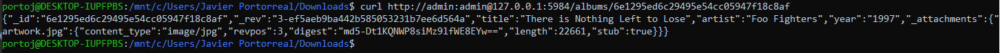

Replication

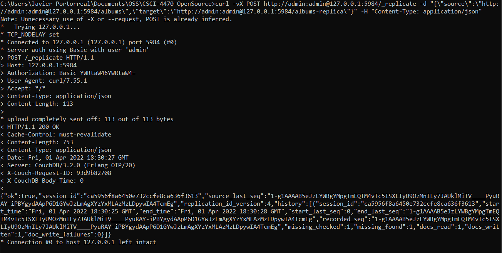

### 4

Year Query

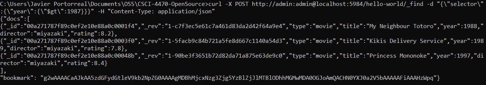

Title Query

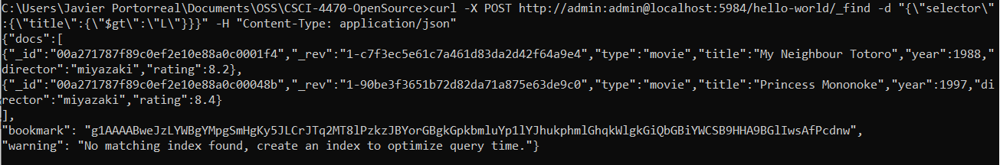

New Index

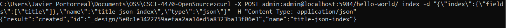

Requery

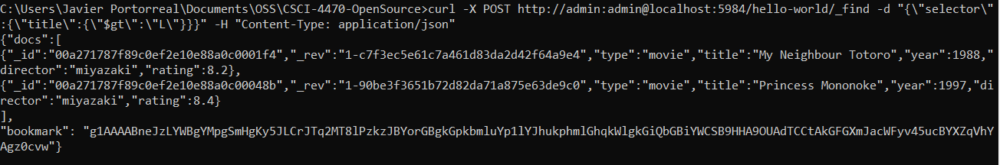
